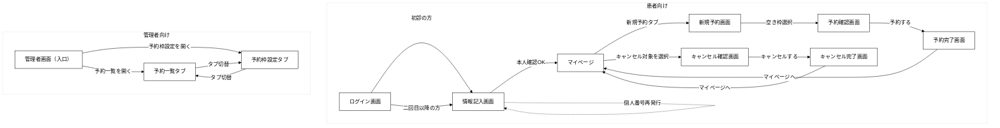
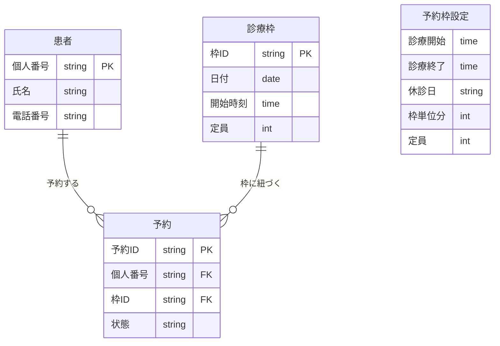

# 成果物テンプレート（チーム：＿＿＿）

# 1. 設計の対象

- **システム名**：オンライン予約管理システム（クリニック向け）
- **想定ユーザー**：患者、受付担当者（管理者）

## 主要機能一覧

| No | 機能名 | 利用者 | 概要 |
|----|--------|--------|------|
| 1 | 患者の新規予約 | 患者 | 日付・時間枠を選び、氏名・電話番号（初回）または個人番号（2回目以降）を入力して予約を登録する。予約完了後に個人番号を表示する。 |
| 2 | 患者の予約確認・キャンセル | 患者 | 個人番号で自分の今後の予約を検索し、内容確認・キャンセルを行う。個人番号を忘れた場合は氏名＋電話番号で再発行できる。 |
| 3 | 予約枠の設定 | 管理者 | 診療時間、休診日、枠の単位（例：30分）、1枠あたりの定員を設定する。予約の基盤となる。 |
| 4 | 予約一覧の閲覧 | 管理者 | 日付や期間を指定し、予約の一覧を確認する。 |

## 詳細設計の前提

- **個人番号の形式**：数字のみ
- **画面構成**：患者向けと管理者向けは別URL
- **予約枠の初期値**：1枠あたり30分、1枠あたり1人まで
- **予約確認・キャンセルの導線**：ユーザーの個人番号入力 → 予約状況確認 → キャンセル
- **管理者の簡易認証**：URLで区別（別URLによるアクセス制御/管理者ユーザーIDとパスワードで管理）

# 2. 画面設計

## 2-1. 画面一覧
| 画面名 | 利用者 | 目的 |
|------|------|------|
| ログイン画面 | 患者 | 初診/2回目以降を選択して入口を振り分ける |
| 情報記入画面 | 患者 | 氏名＋電話（初診）または個人番号（2回目以降）で本人確認する |
| マイページ | 患者 | 今後の予約を表示し、新規予約タブ・キャンセルタブへ導線を提供する |
| 新規予約画面 | 患者 | カレンダーで空き枠を選ぶ |
| 予約確認画面 | 患者 | 選択した枠と入力内容を確認して「予約する」を実行する |
| 予約完了画面 | 患者 | 予約成功を表示し、個人番号（初回のみ）を発行する |
| キャンセル確認画面 | 患者 | キャンセル対象の予約を確認して「キャンセルする」を実行する |
| キャンセル完了画面 | 患者 | キャンセル成功を表示し、マイページへ戻る |
| 管理者画面 | 管理者 | 予約一覧の閲覧と予約枠設定を行う |

## 2-2. 各画面の詳細

### 画面名：ログイン画面

- 利用者：患者
- 目的：初診か2回目以降かを選択し、適切な情報入力へ導く
- 入力項目：なし（選択のみ）
- 表示項目：
  - 「初診の方」ボタン
  - 「二回目以降の方」ボタン
- 主な操作：
  - 「初診の方」選択 → 情報記入画面へ（氏名＋電話番号入力モード）
  - 「二回目以降の方」選択 → 情報記入画面へ（個人番号入力モード）
- 次に遷移する画面：情報記入画面

### 画面名：情報記入画面

- 利用者：患者
- 目的：本人を特定し、マイページへ進む
- 入力項目：
  - 初診：氏名（必須）、電話番号（必須）
  - 2回目以降：個人番号（必須）
  - 個人番号忘れ時：氏名（必須）、電話番号（必須）→ 再発行後、個人番号入力へ
- 表示項目：
  - 入力フォーム（初診は氏名・電話／2回目以降は個人番号）
  - 「個人番号を忘れた方」リンク（2回目以降のときのみ）
- 主な操作：
  - 入力 → 「次へ」→ 照合成功でマイページへ
  - 「個人番号を忘れた方」→ 氏名＋電話番号で照合 → 個人番号を表示 → 個人番号で再入力
- 次に遷移する画面：マイページ

### 画面名：マイページ

- 利用者：患者
- 目的：今後の予約一覧を表示し、新規予約・キャンセルへの導線を提供する
- 入力項目：
  - キャンセルタブ：対象予約の選択
- 表示項目：
  - 今後の予約一覧（日時、状態など）
  - 「新規予約」タブ／「予約キャンセル」タブ
  - キャンセルタブ：予約一覧、各予約のキャンセルボタン
- 主な操作：
  - 「新規予約」タブ選択 → 新規予約画面へ
  - 「予約キャンセル」タブ：対象予約を選択 → キャンセル確認画面へ
- 次に遷移する画面：新規予約画面（新規予約タブ時）、キャンセル確認画面（キャンセルタブで対象選択時）

### 画面名：新規予約画面

- 利用者：患者
- 目的：カレンダーで空き枠を選び、予約を確定する
- 入力項目：
  - 日付選択、時間枠選択
  - 初診の場合：氏名（必須）、電話番号（必須）※情報記入画面で入力済みの場合は表示のみ
- 表示項目：
  - カレンダー
  - 選択日付の空き枠一覧（空き/満枠の状態）
  - 選択した予約日時の確認
- 主な操作：
  - 日付選択 → 空き枠一覧表示 → 枠を選択 → 予約確認画面へ
- 次に遷移する画面：予約確認画面

### 画面名：予約確認画面

- 利用者：患者
- 目的：選択した枠と入力内容を確認し、問題なければ「予約する」で登録する
- 入力項目：なし（修正する場合は「戻る」で新規予約画面へ）
- 表示項目：
  - 選択した予約日時
  - 氏名、電話番号（初回）または個人番号（2回目以降）
  - 注意事項（あれば）
- 主な操作：
  - 「予約する」→ 予約登録実行 → 予約完了画面へ
  - 「戻る」→ 新規予約画面へ
- 次に遷移する画面：予約完了画面、新規予約画面

### 画面名：予約完了画面

- 利用者：患者
- 目的：予約成功を伝え、個人番号（初回のみ）を発行する
- 入力項目：なし
- 表示項目：
  - 予約番号
  - 予約日時、氏名、電話番号（マスク可）
  - 初回のみ：個人番号（次回以降の予約・確認・キャンセルに利用）
- 主な操作：
  - 「マイページへ」→ マイページへ戻る
- 次に遷移する画面：マイページ

### 画面名：キャンセル確認画面

- 利用者：患者
- 目的：キャンセル対象の予約を表示し、「キャンセルする」で取り消しを実行する
- 入力項目：なし
- 表示項目：
  - キャンセル対象の予約（日時、枠情報など）
  - 注意事項（当日キャンセル可否など、あれば）
- 主な操作：
  - 「キャンセルする」→ キャンセル実行 → キャンセル完了画面へ
  - 「戻る」→ マイページへ
- 次に遷移する画面：キャンセル完了画面、マイページ

### 画面名：キャンセル完了画面

- 利用者：患者
- 目的：キャンセル成功を伝え、マイページへ戻る導線を提供する
- 入力項目：なし
- 表示項目：
  - キャンセル完了メッセージ
  - キャンセルした予約の日時（確認用）
- 主な操作：
  - 「マイページへ」→ マイページへ戻る
- 次に遷移する画面：マイページ

### 画面名：管理者画面

- 利用者：受付担当者（管理者）
- 目的：予約状況の一覧確認と、予約枠（診療時間・休診日・枠単位・定員）の設定
- 入力項目：
  - 予約一覧：日付（必須）、期間（任意、開始日/終了日）
  - 予約枠設定：診療開始時刻、診療終了時刻、休診日、枠単位（例：30分）、1枠あたりの人数
- 表示項目：
  - 予約一覧：日時、患者名、電話、状態
  - 枠ごとの空き/満枠（出せる場合）
  - 予約枠設定：現在の設定値
- 主な操作：
  - 日付/期間指定 → 一覧表示
  - 各設定項目の入力・変更 → 保存
- 次に遷移する画面：同一画面内でタブまたはセクション切り替え（予約一覧 ⇔ 予約枠設定）。管理者認証方式は要確認

## 2-3. 画面遷移図

# 3. データ設計

## 3-1. データ一覧

### データ名：患者

- 説明：予約を行う患者の基本情報。初回登録時に氏名・電話番号を紐づけ、個人番号を付与する
- 主な項目：
  - 個人番号
    - 型の例：文字列（数字のみ）
    - 必須/任意：必須（主キー）
    - 説明：患者を一意に識別する番号。初回予約完了時に発行
  - 氏名
    - 型の例：文字列
    - 必須/任意：必須
    - 説明：患者の氏名
  - 電話番号
    - 型の例：文字列
    - 必須/任意：必須
    - 説明：本人確認や連絡に使用

### データ名：診療枠

- 説明：予約可能な日時枠。管理者の設定（診療時間・枠単位・定員）に基づいて生成される
- 主な項目：
  - 枠ID
    - 型の例：数値 または 文字列
    - 必須/任意：必須（主キー）
    - 説明：診療枠を一意に識別するID
  - 日付
    - 型の例：日付型
    - 必須/任意：必須
    - 説明：枠の日付
  - 開始時刻
    - 型の例：時刻型
    - 必須/任意：必須
    - 説明：枠の開始時刻
  - 定員
    - 型の例：数値
    - 必須/任意：必須
    - 説明：1枠あたりの最大予約数（例：1人）

### データ名：予約

- 説明：患者が診療枠に対して行った予約。状態（予約済み/キャンセル）で管理する
- 主な項目：
  - 予約ID
    - 型の例：数値 または 文字列
    - 必須/任意：必須（主キー）
    - 説明：予約を一意に識別するID
  - 患者の個人番号
    - 型の例：文字列
    - 必須/任意：必須
    - 説明：予約した患者を指す
  - 枠ID
    - 型の例：数値 または 文字列
    - 必須/任意：必須
    - 説明：予約した診療枠を指す
  - 状態
    - 型の例：文字列（予約済み / キャンセル）
    - 必須/任意：必須
    - 説明：予約の状態。キャンセル時は「キャンセル」に更新

### データ名：予約枠設定

- 説明：管理者が設定する診療のルール。診療時間・休診日・枠単位・定員を登録し、診療枠を生成する元になる
- 主な項目：
  - 診療開始時刻
    - 型の例：時刻型
    - 必須/任意：必須
    - 説明：診療の開始時刻
  - 診療終了時刻
    - 型の例：時刻型
    - 必須/任意：必須
    - 説明：診療の終了時刻
  - 休診日
    - 型の例：文字列（曜日 または 日付）
    - 必須/任意：任意
    - 説明：休診となる曜日や日付
  - 枠単位（分）
    - 型の例：数値
    - 必須/任意：必須
    - 説明：1枠あたりの時間（分）。例：30
  - 1枠の定員
    - 型の例：数値
    - 必須/任意：必須
    - 説明：1枠あたりの最大予約数

## 3-2. データの関係

- 1人の患者は複数の予約を持てる
- 1つの診療枠には複数の予約が紐づく（ただし定員以内）。満枠になった枠には新規予約できない
- 1件の予約は1人の患者と1つの診療枠に紐づく
- 予約枠設定は、診療枠を生成するためのルールとして使用する（設定値から診療枠テーブルを生成・更新する想定）

## 3-3. 簡易ER図

# 4. 処理設計

## 処理名：予約登録（新規予約）
- 利用者：患者
- 目的：空き枠を選び、本人情報を紐づけて予約を作成する（初回は個人番号を発行する）
- 入力：
  - 日付（必須）
  - 時間枠（必須）
  - 初回：氏名（必須）、電話番号（必須）
  - 2回目以降：個人番号（必須）
  - （任意）備考 ※要確認（今回スコープに含めるか）
- 処理の流れ：
  1. 患者が日付を選ぶ
  2. システムが選択日の時間枠一覧を表示し、空き/満枠を表示する
  3. 患者が空き枠を選ぶ
  4. 患者が本人情報を入力する（初回：氏名＋電話番号、2回目以降：個人番号）
  5. システムが入力チェックを行う（未入力・形式不正など）
  6. システムが「同じ枠が満枠になっていないか」を確認する（定員以内か）
  7. 問題なければ予約を作成し、状態を「予約済み」にする
  8. 初回の場合は個人番号を発行して患者に表示する
  9. 予約完了を表示する
- 成功時の結果：
  - 予約が1件登録される
  - 初回の場合、個人番号が発行される
- エラー時の動作：
  - 必須未入力：未入力項目を強調して「必須項目を入力してください」（ER-01）
  - 電話番号形式不正：形式例を表示して再入力を促す（ER-02）
  - 過去日時：予約不可メッセージを出し、枠選択に戻す（ER-03）
  - 満枠/二重予約：別の時間枠選択へ誘導（ER-04）
- 実装前に確認したいこと：
  - 初回/2回目以降の判定方法（画面の選択で分岐する運用でよいか）※要確認
  - 予約番号を発行するか（仕様書では「発行するなら」）※要確認
  - 個人番号の採番ルール（桁数、重複防止、推測されにくさ）※要確認
  - 当日直前の予約可否（BR-06に関連）※要確認

## 処理名：予約確認（患者）
- 利用者：患者
- 目的：個人番号で自分の「今後の予約」を表示する
- 入力：
  - 個人番号（必須）
  - （救済）氏名＋電話番号で検索 ※要確認（残すかどうか）
- 処理の流れ：
  1. 患者が個人番号を入力して検索する
  2. システムが入力チェックを行う（未入力など）
  3. システムが個人番号に紐づく患者を特定する
  4. システムがその患者の「今後の予約」を取得する（過去分は除外）
  5. 予約一覧（日時、状態）を表示する
- 成功時の結果：
  - 患者の今後の予約が一覧表示される
- エラー時の動作：
  - 必須未入力：入力を促す（ER-01）
  - 個人番号が無効/存在しない：再入力を促し、「個人番号を忘れた方」導線を表示（ER-05）
  - 予約が見つからない：見つからない旨を表示（ER-06）
- 実装前に確認したいこと：
  - 「今後」の定義（当日分を含むか、時刻の扱い）※要確認
  - 電話番号変更や同姓同名の扱い（本人確認方法）※要確認

## 処理名：予約キャンセル（患者）
- 利用者：患者
- 目的：患者が自分の予約を取り消し、枠を空ける
- 入力：
  - 個人番号（必須）※予約確認からの導線なら省略可（要確認）
  - キャンセル対象の予約（必須：予約IDなど）
  - （任意）キャンセル理由 ※要確認
- 処理の流れ：
  1. 患者が予約確認で自分の予約一覧を表示する
  2. 患者がキャンセルしたい予約を選ぶ
  3. システムが確認画面（または確認ダイアログ）を表示する
  4. 患者が「キャンセルする」を実行する
  5. システムが対象予約が存在するか、すでにキャンセル済みでないかを確認する
  6. 予約の状態を「キャンセル」に更新する
  7. 予約一覧を再表示（またはキャンセル完了メッセージを表示）する
- 成功時の結果：
  - 予約状態が「キャンセル」になり、枠の空きが戻る（BR-05）
- エラー時の動作：
  - 対象予約が存在しない/すでにキャンセル済み：エラーメッセージを表示し一覧に戻す（ER-07）
  - キャンセル締切を過ぎている：キャンセル不可として理由を表示 ※要確認（締切ルール）
- 実装前に確認したいこと：
  - 当日キャンセルの可否と締切（BR-05の備考）※要確認
  - キャンセルを「削除」ではなく「状態更新」でよいか（監査/履歴）※要確認

## 処理名：予約一覧表示（管理者）
- 利用者：受付担当者（管理者）
- 目的：指定日（または期間）の予約状況を一覧で把握する
- 入力：
  - 日付（必須）
  - 期間（任意：開始日、終了日）
- 処理の流れ：
  1. 管理者が日付（または期間）を入力して「表示」を押す
  2. システムが入力チェックを行う（未入力、期間の前後など）
  3. システムが指定条件の予約を取得する
  4. 予約一覧（日時、患者名、電話、状態）を表示する
  5. （任意）枠ごとの空き/満枠を表示する ※要確認（必要かどうか）
- 成功時の結果：
  - 指定条件の予約一覧が表示される
- エラー時の動作：
  - 必須未入力：入力を促す（ER-01相当）
  - 期間の指定が不正：エラーメッセージを表示して再入力を促す ※要確認（メッセージ文言）
- 実装前に確認したいこと：
  - 管理者の認証方法（別URLのみでよいか、ID/パスワードが必要か）※要確認
  - 表示対象の粒度（当日、週、月などの既定）※要確認

# 5. 最小API一覧（任意）
| API名 | HTTPメソッド | パス | 用途 | 主な入力 | 主な出力 |
|------|------|------|------|------|------|
| 空き枠一覧取得 | GET | /api/slots | 指定日（期間）の診療枠（空き/満枠含む）を取得する | 日付（必須）、開始日/終了日（任意） | 枠一覧（枠ID、開始時刻、定員、予約数、空き/満枠） |
| 予約登録 | POST | /api/reservations | 枠を指定して予約を作成する（初回は個人番号を返す） | 枠ID、初回：氏名/電話番号 or 2回目以降：個人番号 | 予約ID、予約内容、（初回のみ）個人番号 |
| 予約確認（患者） | GET | /api/patients/{personalNumber}/reservations | 個人番号に紐づく今後の予約を取得する | 個人番号 | 予約一覧（予約ID、日時、状態） |
| 予約キャンセル | PATCH | /api/reservations/{reservationId} | 予約をキャンセル状態に更新する | 予約ID、（任意）キャンセル理由 | 更新後の予約（予約ID、状態） |
| 個人番号再発行 | POST | /api/patients/reissue-personal-number | 氏名＋電話番号で個人番号を再表示/再発行する | 氏名、電話番号 | 個人番号 |
| 予約一覧（管理者） | GET | /api/admin/reservations | 管理者が日付/期間で予約一覧を取得する | 日付（必須）、開始日/終了日（任意） | 予約一覧（日時、患者名、電話、状態） |
| 予約枠設定の取得 | GET | /api/admin/slot-settings | 現在の予約枠設定を取得する | なし | 診療時間、休診日、枠単位、定員 |
| 予約枠設定の更新 | PUT | /api/admin/slot-settings | 予約枠設定を保存する | 診療開始/終了、休診日、枠単位、定員 | 保存結果（OK/NG、設定値） |

# 6. 未確定事項
- 初回/2回目以降の判定方法（ログイン画面の分岐で運用してよいか）※要確認
- 管理者の認証方式（別URLのみ、ID/パスワード必須、など）※要確認
- 予約番号を発行するか、発行する場合の形式 ※要確認
- 個人番号の採番ルール（桁数、再発行時の扱い）※要確認
- 当日直前の予約可否、当日キャンセル可否と締切 ※要確認
- 「今後の予約」の範囲（当日分の扱い）※要確認
- 予約変更をどう扱うか（キャンセル→再予約で代替するか）※要確認
- （任意項目）備考欄・キャンセル理由欄を今回スコープに含めるか ※要確認

# 7. 学び・気づき
- AIに任せてよかった点：仕様書から「必要最小限のデータ（患者/診療枠/予約）」と主要処理（登録/確認/キャンセル/一覧）を漏れなく整理できた
- 人が確認すべきだと感じた点：個人番号の採番・当日運用（予約/キャンセル締切）・管理者認証など、業務ルールに直結する前提は要確認が多い
- 実装前に設計して役立った点：画面→データ→処理→APIの対応が見え、足りない仕様（未確定事項）が早めに洗い出せた
